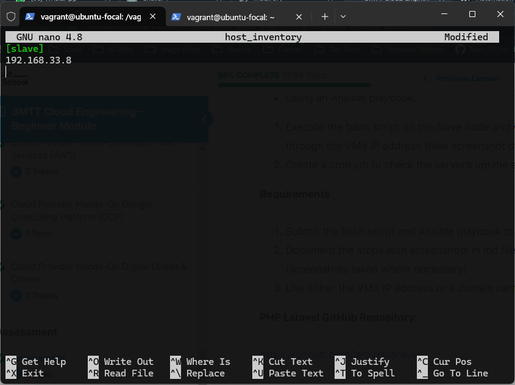
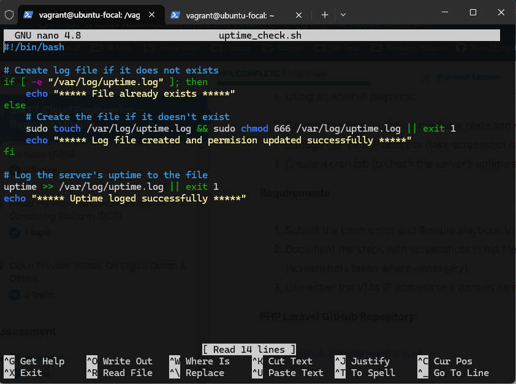
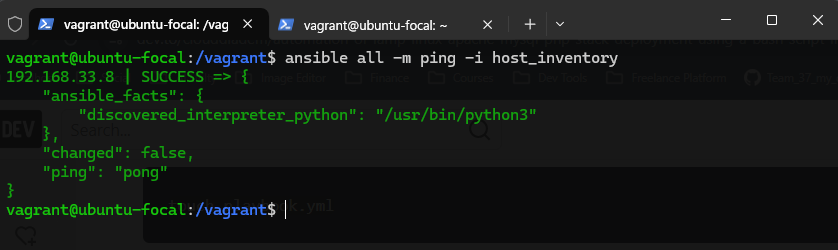
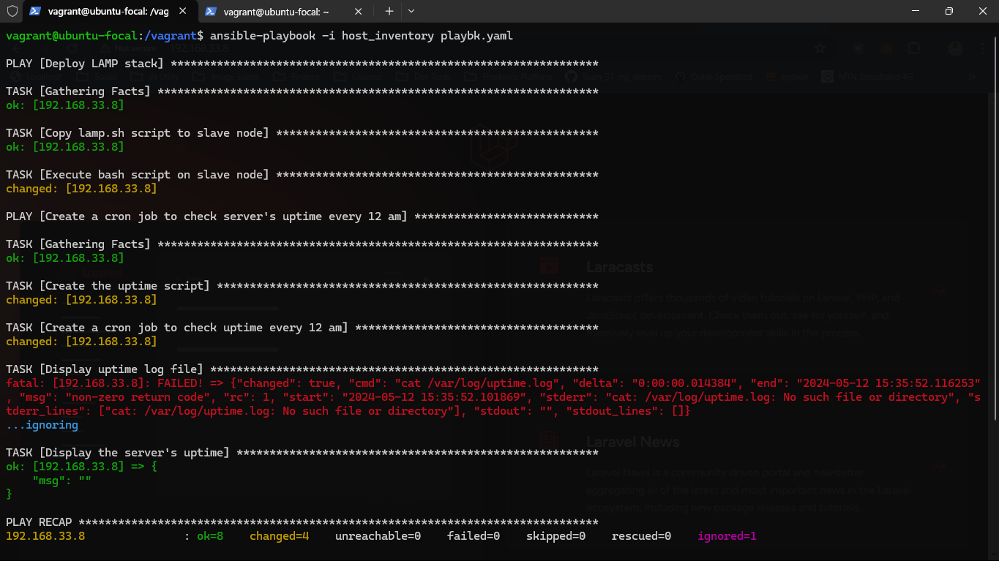
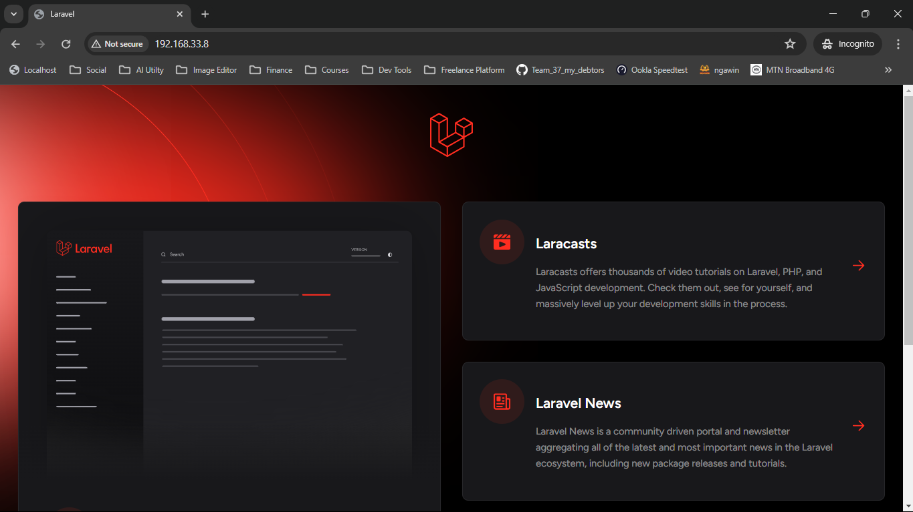

# 3MTT Cloud Engineering – Beginner Module Assessment (Deploy LAMP Stack)

### Objective
* Automate the provisioning of two Ubuntu-based servers, named “Master” and “Slave”, using Vagrant.
* On the Master node, create a bash script to automate the deployment of a LAMP (Linux, Apache, MySQL, PHP) stack.
* This script should clone a PHP application from GitHub, install all necessary packages, and configure Apache web server and MySQL. 
* Ensure the bash script is reusable and readable.
Using an Ansible playbook:
* Execute the bash script on the Slave node and verify that the PHP application is accessible through the VM’s IP address (take screenshot of this as evidence)
* Create a cron job to check the server’s uptime every 12 am.

### Requirements
* Submit the bash script and Ansible playbook to (publicly accessible) GitHub repository.
* Document the steps with screenshots in md files, including proof of the application’s accessibility (screenshots taken where necessary)
* Use either the VM’s IP address or a domain name as the URL.

### PHP Laravel GitHub Repository:
``` https://github.com/laravel/laravel ```

### Submission:
* Submit your work via the 3MTT Cloud Engineering – Beginner Module Assessment
* Push your code to GitHub.
* Share your GitHub link using the submission form.

### Helpful Links:
* https://medium.com/@melihovv/zero-time-deploy-of-laravel-project-with-ansible-3235816676bb

* https://www.cherryservers.com/blog/how-to-install-and-setup-postgresql-server-on-ubuntu-20-04

* https://dev.to/sureshramani/how-to-deploy-laravel-project-with-apache-on-ubuntu-36p3

* https://docs.ansible.com/

## Solution:
* LAMP deployment script
[click to view the lamp scrpit](/beginner-mod-assessment/lamp.sh)

* Uptime check script
[click to view the uptime check scrpit](/beginner-mod-assessment/uptime_check.sh)

* Ansible playbook
[click to view the playbook](/beginner-mod-assessment/playbk.yaml)

* *Sample of my host inventory file:*
In my host inventory file, I have included a sample that contains a slave node in my network. This file is used by configuration management tools to manage multiple hosts more conveniently. To enhance the capabilities of this file, I have added the IP address of the slave node. This will enable more efficient management of this slave and ensure that it is included in all relevant configurations.


* *Sample of my check uptime script:*
This script runs as a cron job, which is a time-based scheduler in Unix-like operating systems. The purpose of the script is to keep track of the system's uptime, which is the amount of time that has elapsed since the last reboot. By running the script periodically, you can monitor the system's availability and performance over time.


* *Tested the master connection to slave with ansible:*
Before executing my playbook file, I made the decision to conduct a ping test on the slave node. To achieve this, I utilized the host inventory file located on the master node. The purpose of this test was to ensure that the slave node was reachable and could communicate with the master node before running the playbook.


* *Execution of ansible playbook:*
I executed the ansible playbook and I'm happy to report that the entire process was executed smoothly and efficiently, leaving no room for errors or complications. As evidence of the successful execution, the image below shows the final output and confirms that all the necessary tasks were completed as expected.


* *Slave node web view Sample:*
Upon accessing the slave node through the browser, I observed that it was up and running smoothly without any issues, as clearly depicted in the image below.

