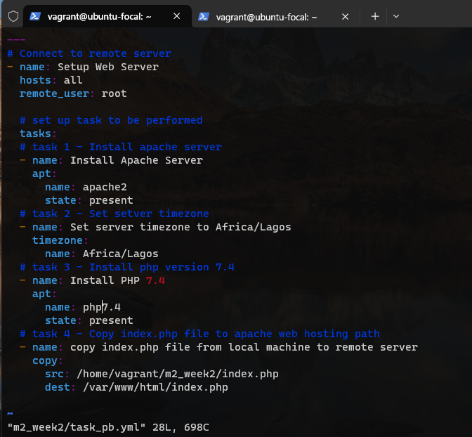
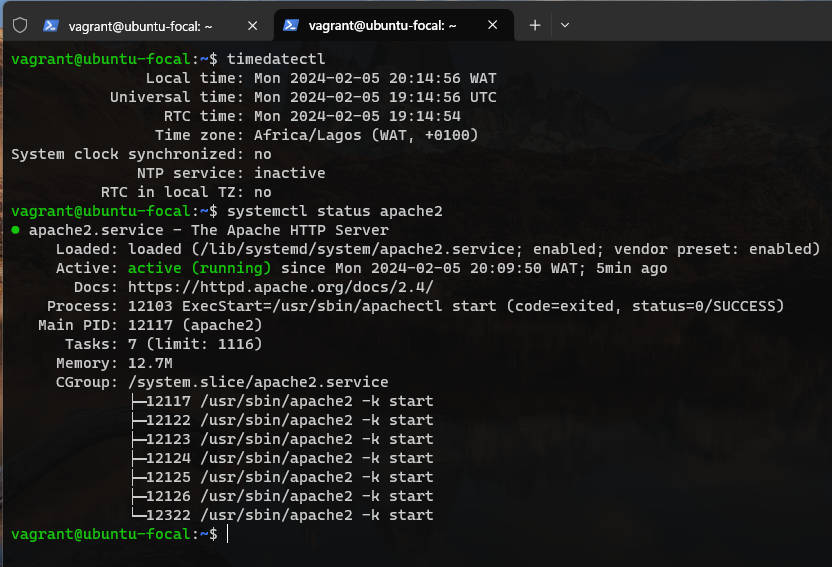
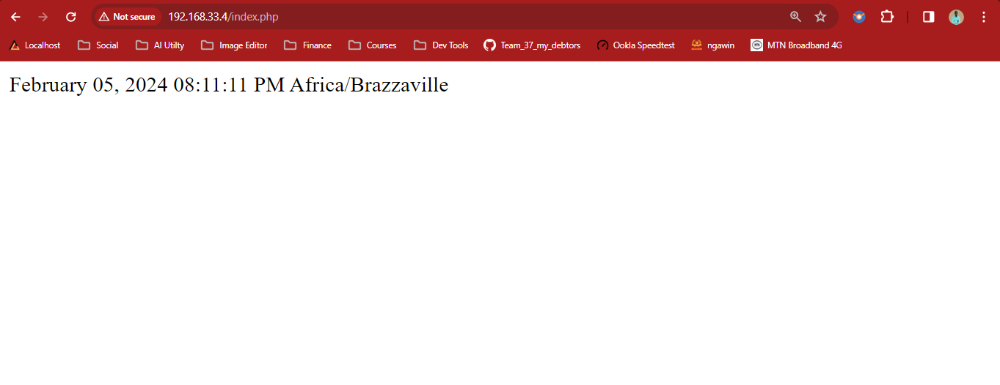

# Exercise 9 (Ansible)

### Task: Create an Ansible Playbook to setup a server with Apache. The server should be set to the Africa/Lagos Timezone. Host an index.php file with the following content, as the main file on the server:
```
<?php
echo date("F d, Y h:i:s A e", time());
?>
```

*Instruction:*
* Submit the Ansible playbook, the output of systemctl status apache2 after deploying the playbook and a screenshot of the rendered page

*Solution:*
* ansible playbook


* apache status


* rendered page

