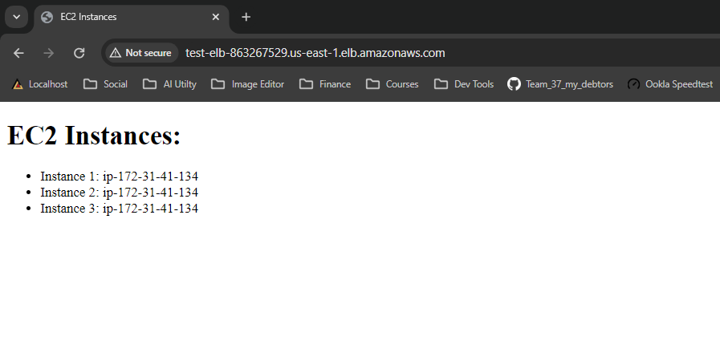

# Mini Project (Exercise 12) Using Terraform with AWS

### Task:
* Using Terraform, create 3 EC2 instances and put them behind an Elastic Load Balancer
* Make sure the after applying your plan, Terraform exports the public IP addresses of the 3 instances to a file called host-inventory
* Get a .com.ng or any other domain name for yourself (be creative, this will be a domain you can keep using) and set it up with AWS Route53 within your terraform plan, then add an A record for subdomain terraform-test that points to your ELB IP address.
* Create an Ansible script that uses the host-inventory file Terraform created to install Apache, set timezone to Africa/Lagos and displays a simple HTML page that displays content to clearly identify on all 3 EC2 instances.
* Your project is complete when one visits terraform-test.yoursdmain.com and it shows the content from your instances, while rotating between the servers as your refresh to display their unique content.

*Instruction:*
* Submit both the Ansible and Terraform files created

*Solution:*
* Mini Project Sample

* Ansible File Content
[Click to view the ansible playbook sample file](terraform_mini_project/playbook.yml)

* Terraform File Content
[Click to view the terraform sample file](terraform_mini_project/playbook.yml)
