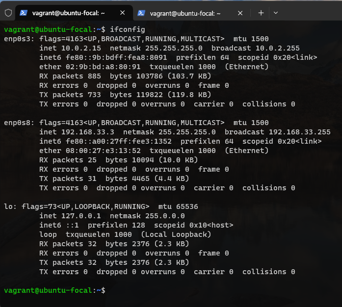

# Exercise 1 (Linux OS Setup)

### Task: Setup Ubuntu 20.04 LTS on your local machine using Vagrant

*Instruction:*
* Customize your Vagrantfile as necessary with private_network set to DHCP
* Once the machine is up, run ifconfig and share the output in your submission along with your Vagrantfile in a folder for this exercise.

*Solution:*

# Exercise 2 (Linux Command)

### Task: Research online for 10 more Linux commands aside the ones already mentioned in this module. Submit using your AltSchool-cloud-exercises project, explaining what each command is used for with examples of how to use each and example screenshots of using each of them.

*Instruction:*
* Submit your work in a folder for this exercise in your altschool-cloud-exercises project. You will need to learn how to embed images in markdown files.

*Solution:*
* move one level up: 
`cd ..`

* lists all files/directories with detailed information:
`ll -a`

* create an alias for a frequently used command: 
`alias cl=clear`

* append to a file: 
`echo "add new line" >> file.txt`

* delete directory: 
`rm -r DIR`

* compress files: 
`tar -cvf FILENAME.tar file1 file2 file3`

* extract files: 
`tar -xvf FILENAME.tar`

* create a use: 
`sudo useradd USER`

* set a password for the user: 
`sudo passwd USER`

* add a user to a group: 
`sudo usermod -aG GROUP USER`
