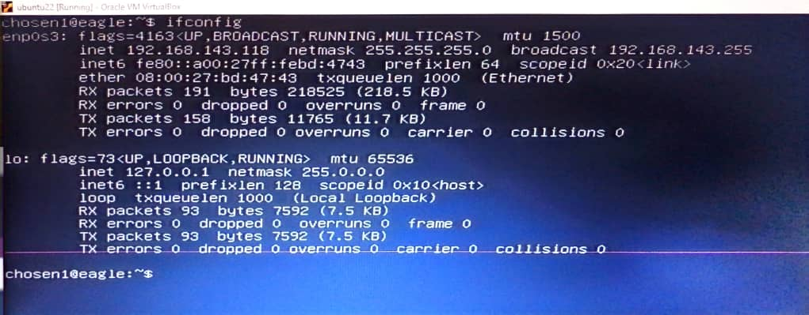

# Exercise 1
### Task: Setup Ubuntu 20.04 LTS on your local machine using Vagrant

*Instruction:*
* Customize your Vagrantfile as necessary with private_network set to DHCP
* Once the machine is up, run ifconfig and share the output in your submission along with your Vagrantfile in a folder for this exercise.

*Solution:*

# Exercise 2
### Task: Research online for 10 more Linux commands aside the ones already mentioned in this module. Submit using your AltSchool-cloud-exercises project, explaining what each command is used for with examples of how to use each and example screenshots of using each of them.

*Instruction:*
* Submit your work in a folder for this exercise in your altschool-cloud-exercises project. You will need to learn how to embed images in markdown files.

*Solution:*
